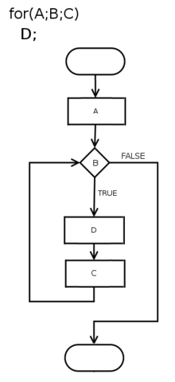

# Decisiones y Repeticiones

El lenguaje da herramientas para cambiar el orden normal secuencial de ejecución y también para hacer repeticiones o mejor dicho iteraciones, porque aunque se repite el código pero las variables son distintas, nadie se baña dos veces en el mismo río. 

# Decisiones

## if-else, switch-case

### if - else
Se utiliza para ejecutar código diferente según alguna condición. La expresión adentro del if se evalúa y define el camino a seguir, si el resultado es verdadero se ejecuta sentencia_1, si es falso se ejecuta la sentencia_2. En ningún caso se ejecutan ambas.

```Java
        if(expresión)  
          sentencia_1;  
        else  
          sentencia_2;  
```

La cláusula **else** es opcional. La sentencia_1 y sentencia_2 pueden ser una sola sentencia o bloques. 

Si se usan bloques queda

```Java
        if(expresión) {  
          sentencias_1; 
        }else{  
          sentencias_2;  
        }  
```
        
Se recomienda usar llaves siempre para evitar ambiguedades. Si bien se *pueden* "anidar" if's, es decir se pueden poner otros if-else dentro de alguno de los bloques if-else, no se aconsejan anidar demasiados if's, ya que hacen al código menos legible.

### switch - case

Con **switch** se compara una variable con una lista de constantes posibles. Cuando encuentra una coincidencia ejecuta el bloque que corresponde al **case**, y si luego de evaluar todos los **case** no se encuentra ninguna coincidencia, se ejecuta el código bajo la palabra **default**. Normalmente las constantes son numéricas,  a partir de Java 7, además se pueden usar Strings.

```Java
switch (variable) {  
  case constante_1:  
        sentencias;  
        break;  
  case constante_2:  
         sentencias;  
         break;  
  case constante_3:  
         sentencias;  
         break;  
  //...  
  default:  
         sentencias;  
         break;  
}  
```

Las sentencias se ejecutan hasta encontrar **break**; si no hay **break** el programa sigue adelante hasta encontrar la llave de cierre del switch, si en un **case** falta algún **break** se ejecutará también el **case** siguiente, esto puede ser rara vez intencional si dos constantes tienen alguna acción en común, o por error común, olvidarse de poner **break**. El bloque **switch** sólo chequea por igualdad, no evalua expresiones lógicas ni relacionales, por lo que no puede haber dos case con constantes de mismo valor.

# Repeticiones

## for, while, do-while, break, continue

### for

Se utiliza para repetir un bloque de código una cantidad de veces determinada.

```Java
for(inicializacion ; condicion ; incremento/decremento) {  
    sentencia1;  
    sentencia2;  
    sentenciaN;  
}  
```
Agrupa 3 acciones 

*Inicialización*, asigna valor inicial a la variable de control del bucle.  
*Condición*, determina cuando finaliza el bucle, evalúa la expresión *antes* de cada iteración, si el resultado es falso, finaliza.   
*Incremento/decremento*, se ejecuta *después* de cada iteración para modificar la variable de control en cada iteración.  

<p align="center">
        
</p>

fuente: https://en.wikipedia.org/wiki/For_loop

### while

Permite repetir la ejecución de un bloque de código, mientras una determinada condición sea cierta, se usa sobretodo cuando la cantidad de iteraciones no se conoce al momento de programar sino que se define en *runtime*, es decir, mientras corre el programa.

```Java
while(expresion) {  
    sentencia1;  
    sentencia2;  
    sentenciaN;  
}
```

### do-while
El bucle do-while examina la condición recién al final del bloque, por lo que un bucle do-while se ejecuta al menos una vez ( a diferencia de **while** y **for** que pueden no ejecutarse ninguna vez ya que comprueban la condición antes de ingresar al bucle)

```Java
do {  
    sentencia1;  
    sentencia2;
    sentenciaN  
} while (expresion);  
```

## Recursividad 
En un llamado recursivo una función se invoca a sí misma, permitiendo reutilizar partes de la función en algún proceso iterativo, se debe preveer alguna condición para que la función deje de llamarse a sí misma para evitar un stackoverflow.


